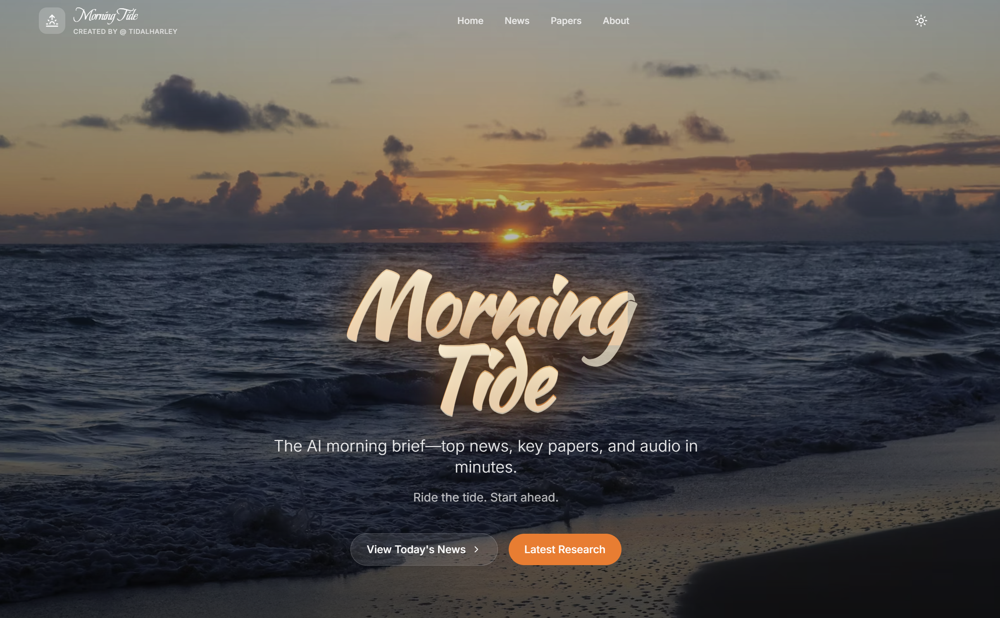
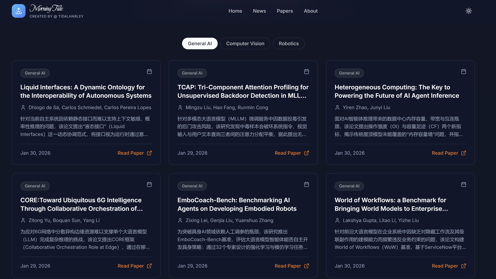
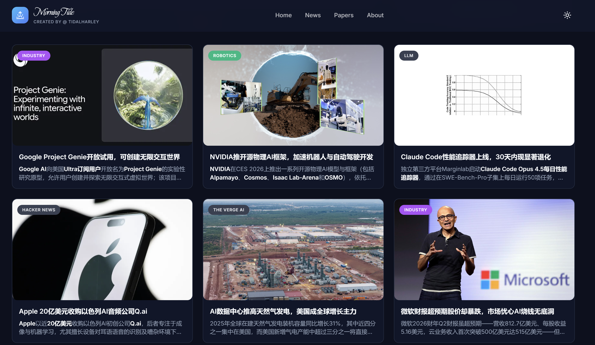

# Morning Tide: 你的私人ai新闻秘书

**完全免费、零门槛、易部署、高质量**
更新于每日07：00北京时间

[English](README.md)

在线访问: https://tidalharley.github.io/Morning-Tide/

<p align="center">
  
</p>


---

## 为什么是Morning Tide?

### 对学生/AI领域爱好者（零代码、免费、无门槛）

- **一页看全**：每天从超过20+全球顶尖公司实验室官方网站收集AI新闻，加以精选，确保所见即所发生
- **消灭信息差**：**每天 5 分钟**，稳定立于AI时代潮头，洞悉全球AI发展百态，信息差和信息不对等已经是**过去式**
- **无需任何学习成本**：完全开源、不注册、不配置、不写代码、完全免费、没有广告，点击即看

### 对 开发者（部署快、维护省）

- **快速部署**：前端 Vite + 后端 Python pipeline，配合 GitHub Pages + GitHub Actions（或 cron）即可上线
- **自动更新**：每天跑一次 pipeline，只需20分钟，输出 `tide-news.json`，网页自动刷新内容
- **价格极低**：采用Qwen-flash和Qwen-3-max模型，独立部署每日成本不足0.5$(usd)，极其适合私人化部署
- **适合个性化开发**: 结构化代码，适合高质量微调针对需求继续开发

### 对 论文研究者（阅读快、信源真）

- **阅读省时**：每日爬取Huggingface和Arxiv的全部论文，分类为[general_ai],[computer_vision],[robotics]，配有概述，概览行业发展
- **信源真实**：所有论文来自于Huggingface和arxiv，点击即可跳转，确保可信度

<p align="center">
  
</p>

### 你的最佳AI新闻秘书
- 在这个信息爆炸的时代，去伪存真，充分摄入高质信息有助于您保持独立思考，做出正确决策
- **上班族**：每天一眼“行业/技术风向”，启发思考，保持对新工具和新趋势的敏感度，工作转型/工作结合的不二之选
- **论文研究者**：每日 **arXiv 分领域精选**，节约大量时间，潜在的组会选题/未来研究参考
- **开发者/创作者**：持续更新技术栈认知，避免“错过关键发布/方法论”的尴尬，与AI时代同行

---

<p align="center">
  
</p>

## 信息来源

<table align="center">
  <tr>
    <td align="center"><br/>arXiv</td>
    <td align="center"><br/>Hugging Face Daily Papers</td>
    <td align="center"><br/>Hacker News</td>
    <td align="center"><br/>Reddit</td>
    <td align="center"><br/>GitHub Trending</td>
  </tr>
  <tr>
    <td align="center"><br/>OpenAI Blog</td>
    <td align="center"><br/>Google AI Blog</td>
    <td align="center"><br/>DeepMind Blog</td>
    <td align="center"><br/>Microsoft Research</td>
    <td align="center"><br/>NVIDIA Blog</td>
  </tr>
  <tr>
    <td align="center"><br/>BAIR Blog</td>
    <td align="center"><br/>The Verge AI</td>
    <td align="center"><br/>TechCrunch AI</td>
    <td align="center"><br/>VentureBeat AI</td>
    <td align="center"><br/>MIT Tech Review AI</td>
  </tr>
  <tr>
    <td align="center"><br/>AWS ML Blog</td>
    <td align="center"><br/>Google Cloud AI</td>
    <td align="center"><br/>Microsoft AI Blog</td>
    <td align="center"><br/>NVIDIA Developer AI</td>
    <td align="center"><br/>MIT CSAIL News</td>
  </tr>
</table>

---


---


## 技术栈

<table align="center" style="border-collapse:separate;border-spacing:10px;">
  <tr>
    <td align="center" style="border:1px solid #e5e7eb;padding:10px 12px;"><br/>React</td>
    <td align="center" style="border:1px solid #e5e7eb;padding:10px 12px;"><br/>TypeScript</td>
    <td align="center" style="border:1px solid #e5e7eb;padding:10px 12px;"><br/>Vite</td>
    <td align="center" style="border:1px solid #e5e7eb;padding:10px 12px;"><br/>Tailwind</td>
    <td align="center" style="border:1px solid #e5e7eb;padding:10px 12px;"><br/>Python</td>
  </tr>
  <tr>
    <td align="center" style="border:1px solid #e5e7eb;padding:10px 12px;"><br/>Qwen</td>
    <td align="center" style="border:1px solid #e5e7eb;padding:10px 12px;"><br/>OpenAI</td>
    <td align="center" style="border:1px solid #e5e7eb;padding:10px 12px;"><br/>GitHub Actions</td>
    <td align="center" style="border:1px solid #e5e7eb;padding:10px 12px;"><br/>Vercel</td>
    <td align="center" style="border:1px solid #e5e7eb;padding:10px 12px;"><br/>Netlify</td>
  </tr>
</table>

## 快速开始

### 启动前端

```bash
cd Morning-Tide
npm install
npm run dev
```

按终端提示打开本地地址即可。

### 运行 Pipeline（生成当天报告）

```bash
cd Morning-Tide
python -m venv .venv
# Windows PowerShell:
.venv\Scripts\Activate.ps1

pip install -r pipeline/requirements.txt

# 配置环境变量（参考 env.example）
python -m pipeline.main
```

---

## 配置说明

复制 `env.example` 并按需填写：

- **L2/L3 必需（AI 打分与精炼）**：`DASHSCOPE_API_KEY`（通过 DashScope 兼容接口调用 Qwen）
- **可选（音频）**：`OPENAI_API_KEY`
- **可选（网络）**：`AI_TIDES_USE_PROXY`、`AI_TIDES_VERIFY_SSL`

更多参数在 `pipeline/config.py`。

---

## 部署建议

### 方案 A：GitHub Pages + GitHub Actions（推荐）

- 前端用 GitHub Pages 托管（静态 `dist/`）。
- GitHub Actions 每天北京时间 07:00 自动运行 pipeline，提交最新数据并触发 Pages 更新。

#### 设置你的 DASHSCOPE_KEY
1. 进入 **你的仓库** → Settings → Secrets and variables → Actions → New repository secret
2. 新增 `DASHSCOPE_API_KEY`(privacy ensured)

#### 本地独立部署
- **Fork 部署**：在你 fork 的仓库里同样设置 `DASHSCOPE_API_KEY` Secret。
- **本地运行**：复制 `env.example` 为 `.env`，填写你自己的 `DASHSCOPE_API_KEY`。

详见 `docs/deployment.md`。

---

## 目录结构

```text
Morning-Tide/
  pipeline/                 # 摄取 + 过滤 + 输出
  public/                   # 静态资源（以及可选历史归档）
  src/                      # React 前端
  docs/                     # 架构与部署文档
```


## Credits

Made by **@TidalHarley**。如果你喜欢这个项目，欢迎点个 ⭐ 帮我把它推给更多人。

